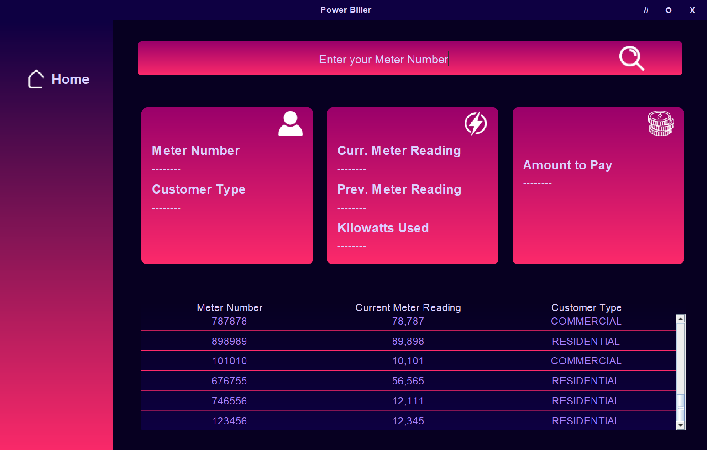
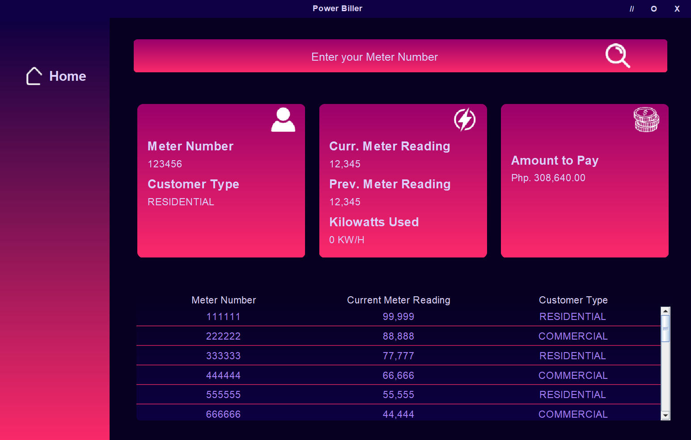

# power-biller

A power management java program

## About

> #### *The instruction is ugly AF*

Computes the kilowatts used by a customer (user) by subtracting their 
current and previous meter reading (both are the same when the customer is a new input). The amount to be paid by the user is determined by their status whether they are a residential or commercial user. 

### Used Computations
- Kilowatts per Hour (current reading - previous reading) (*adds 100, 000 to current if lower than previous*)
- Amount to Pay (kilowatts per hour * customer type multiplier)
    - kwh < 100, 100 < kwh <= 200, kwh > 200
    - multiplier for residential: 1.50, 2.00, 2.50
    - multiplier for commercial: 3.00, 4.00, 5.00

### GUI

